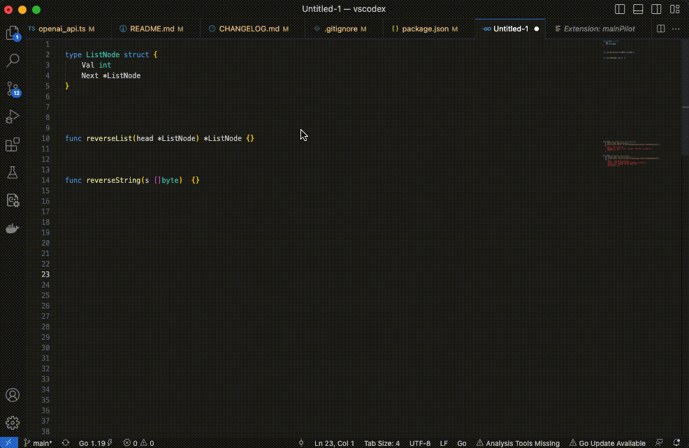

# MainPilot

thanks to https://github.com/VincentHch/vscodex

```
echo 'export OPENAI_API_KEY=********' >> ~/.bashrc
```

## Building and installing extension

```
npm install -g vsce
git clone git@github.com:OwenLIULIU/mainPilot.git
cd mainPilot
npm install
vsce package
code --install-extension *.vsix
```

## Example

